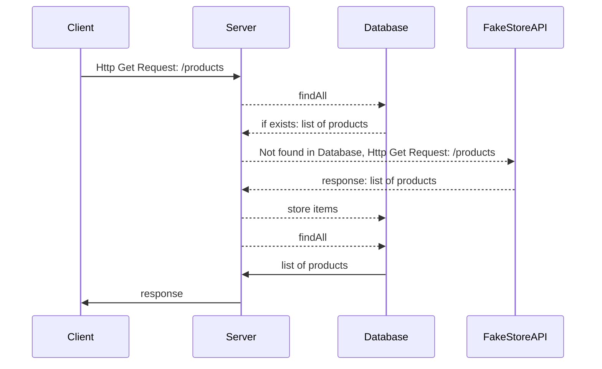
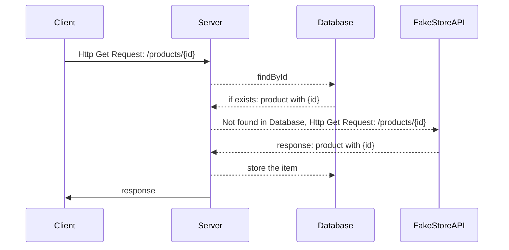

# Ace Products

## Description

This service expose a JSON API that clients can call to fetch the data stored in the database. 
If the data is not available in your database, it will fetch it from the upstream API.

There are two endpoints:
* Product listing endpoint:
  - Method: GET
  - Action: Get all products
  - URI: /products
* Product details endpoint:
  - Method: GET
  - Action: Get specific product by id
  - URI: /products/{productid}

It uses embedded database for easier setup and configuration. The general flow of each endpoint
are described down below:





## Quick Start

run the following command to start the server
```bash
./mvnw spring-boot:run
```

To get the product lists run
```bash
curl --location 'localhost:8080/products' \
--header 'Content-Type: application/json'
```
To get the product with specific id run
```bash
curl --location 'localhost:8080/products/1' \
--header 'Content-Type: application/json'
```

With pagination, simply add `page` query parameter, for example
```bash
curl --location 'localhost:8080/products?page=1' \
--header 'Content-Type: application/json'
```

### Additional Query Parameters

Available filters are:
* `minPrice`: get products with price higher or equal than `minPrice`.
* `maxPrice`: get products with price lower than `maxPrice`
* `category`: get products with given categories.
All parameters can be combined.

### Examples

To filter the products with specific price range add `minPrice` and 
`maxPrice` queryParameters, for example get products with price between 22 and 100
```bash
curl --location 'localhost:8080/products?page=1&minPrice=22&maxPrice=100' \
--header 'Content-Type: application/json'
```

To filter the products within price range (22, 100) and within given categories(men's clothing, jewelery)
```bash
curl --location 'localhost:8080/products?page=1&maxPrice=100&minPrice=22&category=men%27s%20clothing&category=jewelery' \
--header 'Content-Type: application/json'
```

